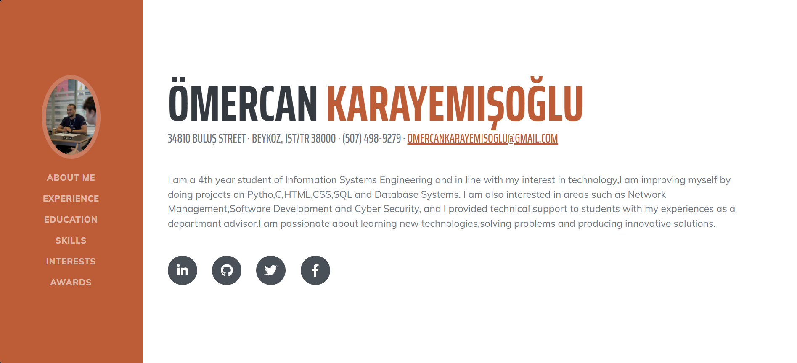
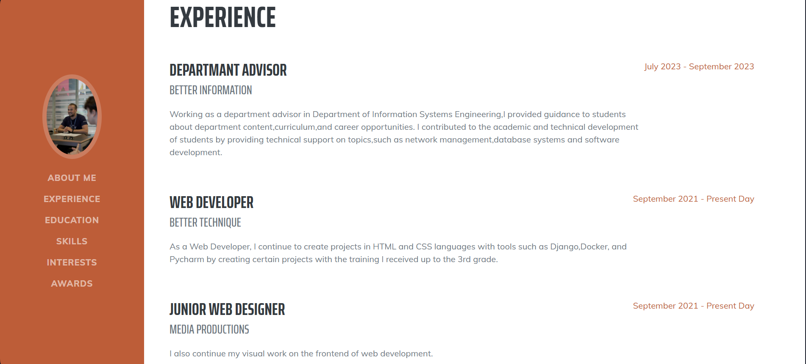
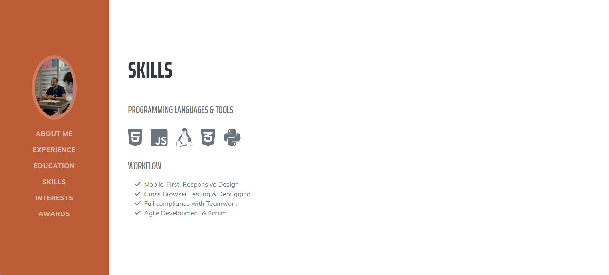
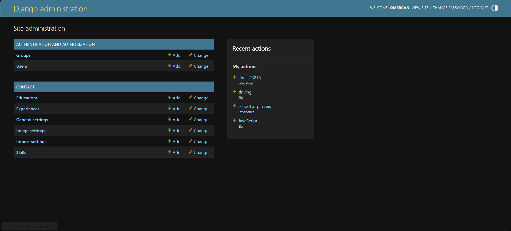

# 🧑‍💼 Django CV Web Application

A customizable CV website built using **Django**. This project allows users to manage their resume content dynamically via the Django Admin Panel — without directly editing any code.

---

## 🖼️ Screenshots

| About Me | Education |
|----------|-----------|
|  |  |

| Experiences | Skills |
|-------------|--------|
|  |  |

### 🔐 Admin Panel View


---

## 📌 Project Overview

This CV website is designed as a professional online portfolio for individuals who want to present their background, skills, education, and experience in a clean and organized way — all manageable through the Django admin panel.

---

## ⚙️ Technologies Used

- **Backend:** Python, Django
- **Frontend:** HTML5, CSS3, JavaScript
- **Tools:** PyCharm, SQLite, Django Admin
- **Libraries:** FontAwesome, Google Fonts

---

## 🚀 How to Run

> Ensure that Python and Django are installed.

### 1. Clone the Repository

```bash
git clone https://github.com/omerkry/django_project.git
cd django_project

2. Create and Activate a Virtual Environment
python -m venv venv
venv\Scripts\activate        # Windows
# OR
source venv/bin/activate     # macOS/Linux

3. Install Dependencies
pip install -r requirement.txt

4. Apply Migrations
python manage.py migrate

5. Create a Superuser
python manage.py createsuperuser

6. Start the Server
python manage.py runserver

Then open in your browser:

🌐 http://127.0.0.1:8000/ – CV website

🔐 http://127.0.0.1:8000/admin/ – Admin dashboard

👨‍💻 Author
Ömercan Karayemişoğlu
📧 omercankarayemisoglu@gmail.com
🌐 GitHub

📜 License
This project is licensed under the MIT License.
Feel free to use, modify, and share for any personal or commercial purpose.
